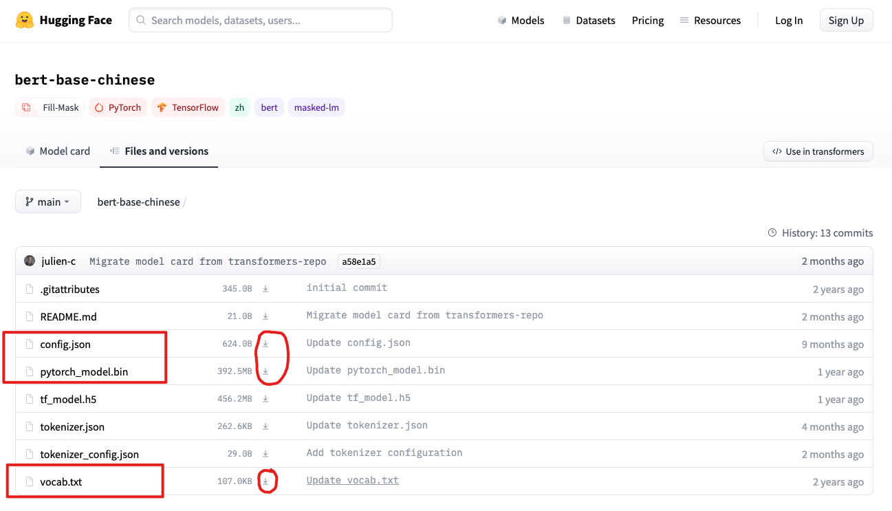
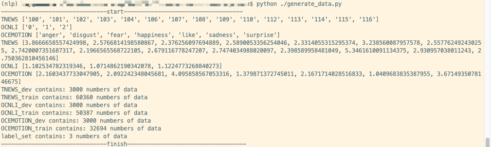
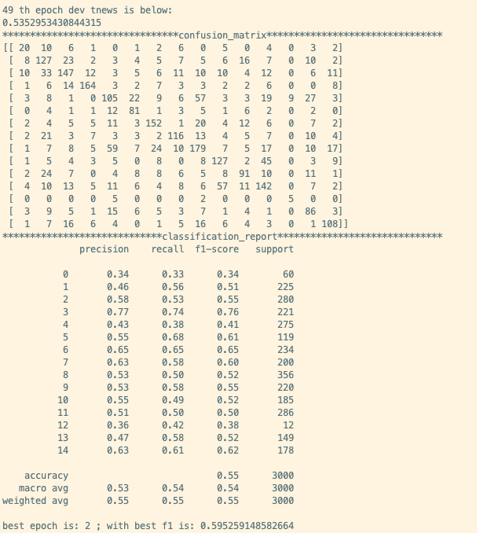
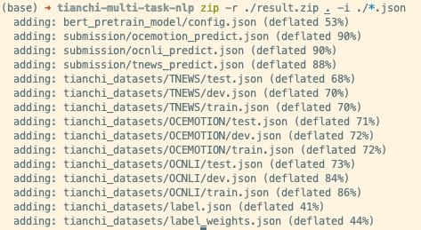
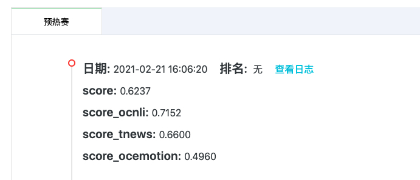

# 前言

本次学习内容为：天池赛事 - 中文预训练模型泛化能力挑战赛（NLP）

1. 比赛地址：https://tianchi.aliyun.com/s/3bd272d942f97725286a8e44f40f3f74
2. 论坛地址：http://datawhale.club/t/topic/1417
3. 开源内容：https://github.com/datawhalechina/team-learning-nlp/tree/master/PretrainModelsGeneralization


# 环境配置

## Mac OSX

1. 安装transformer

   ```
   # Mac的zsh终端中，直接使用以下两个命令安装会有问题
   conda activate py37
   pip install transformers
   ```

   参考[CSDN](https://blog.csdn.net/qq_40664172/article/details/109147797)后解决：

   ```
   # 修改zshrc文件后
   # 使用以下命令安装：
   pip install transformers[torch]
   ```

2. 其他

   ```
   pip install sklearn
   ```

## Ubuntu版

1. 进入[Pytorch官网](https://pytorch.org/)安装pytorch

   ```
   conda create -n nlp python=3.7
   conda install pytorch=1.7 torchvision torchaudio cudatoolkit=10.2
   ```

   删掉-c pytorch的话，就会从清华源安装，但默认安装的是1.3版本（还是cpu的），所以我们就加上pytorch的版本

2. 其他：

   ```
   conda activate nlp
   pip install transformers
   pip install sklearn
   ```


# 下载数据文件

1. 下载GitHub上的[代码](https://github.com/finlay-liu/tianchi-multi-task-nlp)

   ```
   git clone https://github.com/finlay-liu/tianchi-multi-task-nlp.git
   ```

2. 下载bert权重文件：
   下载地址：https://huggingface.co/bert-base-chinese/tree/main

   只需下载图2中的`config.json`、`vocab.txt`和`pytorch_model.bin`这三个文件，点击右边的下载图标进行下载，`config.json`、`vocab.txt`这两个文件点击下载后会弹出网页，保存页面即可。

   <center>        <br>    <div style="color:orange; border-bottom: 1px solid #d9d9d9;    display: inline-block;    color: #999;    padding: 2px;">图1 下载数据文件</div> </center>

3. 下载比赛数据集，下载以下链接的数据集，把三个数据集分别放进`tianchi-multi-task-nlp/tianchi_datasets/数据集名字/`下面（分别建立文件夹并重命名数据集）：

   ```
   OCEMOTION/total.csv:http://tianchi-competition.oss-cn-hangzhou.aliyuncs.com/531841/OCEMOTION_train1128.csv
   OCEMOTION/test.csv: http://tianchi-competition.oss-cn-hangzhou.aliyuncs.com/531841/b/ocemotion_test_B.csv
   TNEWS/total.csv: http://tianchi-competition.oss-cn-hangzhou.aliyuncs.com/531841/TNEWS_train1128.csv
   TNEWS/test.csv: http://tianchi-competition.oss-cn-hangzhou.aliyuncs.com/531841/b/tnews_test_B.csv
   OCNLI/total.csv: http://tianchi-competition.oss-cn-hangzhou.aliyuncs.com/531841/OCNLI_train1128.csv
   OCNLI/test.csv: http://tianchi-competition.oss-cn-hangzhou.aliyuncs.com/531841/b/ocnli_test_B.csv
   ```

   文件目录样例：

   ```
   tianchi-multi-task-nlp/tianchi_datasets/OCNLI/total.csv
   tianchi-multi-task-nlp/tianchi_datasets/OCNLI/test.csv
   ```


# 训练模型

1. 运行以下命令将训练集拆分为数据集与验证集，默认验证集是各3000条数据，参数可以自己修改：

   ```
   python generate_data.py
   ```

   输出如图1：

   <center>        <br>    <div style="color:orange; border-bottom: 1px solid #d9d9d9;    display: inline-block;    color: #999;    padding: 2px;">图2 生成数据</div> </center>

2. 修改超参数并训练模型：

   ```
   python train.py
   ```

   训练了50个epoch之后，输出结果如图3。训练结束后，会在`tianchi-multi-task-nlp/`路径下生成一个`saved_best.pt`模型文件。

   <center>        <br>    <div style="color:orange; border-bottom: 1px solid #d9d9d9;    display: inline-block;    color: #999;    padding: 2px;">图3 训练过程</div> </center>


# 测试结果

1. 使用训练好的模型`./saved_best.pt`生成测试结果：

   ```
   python inference.py
   ```

2. 将`tianchi-multi-task-nlp/`路径下的所有json文件打包：

   ```
   zip -r ./result.zip ./*.json  # 这个命令有误，用下面的
   
   zip -r ./result.zip . -i ./*.json
   ```

   <center>        <br>    <div style="color:orange; border-bottom: 1px solid #d9d9d9;    display: inline-block;    color: #999;    padding: 2px;">图4 打包文件</div> </center>


# Docker提交

参考：

```
https://tianchi.aliyun.com/competition/entrance/231759/tab/174
```

1. 将`tianchi-multi-task-nlp⁩/result.zip`移动至`⁨tianchi-multi-task-nlp⁩/submission⁩`路径下，然后在终端进入`⁨tianchi-multi-task-nlp⁩/submission`路径：

   ```
   cd submission
   ```

2. 登录

   ```
   sudo docker login --username=用户名 registry.cn-shenzhen.aliyuncs.com
   ```

3. 构建镜像

   ```
   docker build -t 公网地址/版本号 .
   
   docker build -t registry.cn-shenzhen.aliyuncs.com/deeplearning_ray/tianchi_nlp_generalize/1.0 .
   ```

4. 将镜像推送至Registry（确保自己已经使用`docker login`登录）
   `docker tag` 命令会重命名镜像，并将它通过专有网络地址推送至Registry。
   `docker push` 命令将该镜像推送至远程。

   ```
   sudo docker tag [ImageId] 公网地址:[镜像版本号]
   sudo docker push 公网地址:[镜像版本号]
   
   sudo docker tag ab3e248ccb4d registry.cn-shenzhen.aliyuncs.com/deeplearning_ray/tianchi_nlp_generalize:1.0
   sudo docker push registry.cn-shenzhen.aliyuncs.com/deeplearning_ray/tianchi_nlp_generalize:1.0
   ```

   请根据实际镜像信息替换上述命令中的[ImageId]和[镜像版本号]参数。ImageId为镜像ID。

   > 这里还需要注意是，构建镜像和推送镜像时填写的`registry.cn-XXX.aliyuncs.com`一定要和登录时用的一样。。。我登录用的深圳的，构建镜像时用的是杭州的仓库，然后就推送不上去，会显示`denied: requested access to the resource is denied`的错误。

5. 提交比赛结果
   登录[比赛提交页面](https://tianchi.aliyun.com/competition/entrance/531865/submission/723)，配置镜像路径：

   ```
   公网地址/版本号
   阿里云用户名
   容器镜像服务的密码
   ```

6. 提交成绩

   <center>        <br>    <div style="color:orange; border-bottom: 1px solid #d9d9d9;    display: inline-block;    color: #999;    padding: 2px;">图5 第一次提交的成绩</div> </center>

