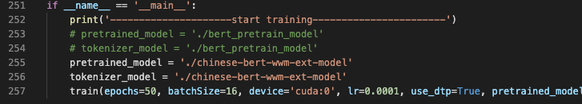

# 前言

​	本次学习的内容为，对baseline进行改进。

# 改进

​		第一次在流程体验的时候，使用的预训练模型是[bert-base-chinese](https://huggingface.co/bert-base-chinese)。本次改进主要是将预训练模型修改为：[chinese-bert-wwm-ext](https://huggingface.co/hfl/chinese-bert-wwm-ext)，这是哈工大讯飞联合实验室发布的，项目地址为[github](https://github.com/ymcui/Chinese-BERT-wwm)。

1. 首先下载模型权重：

   在这个[地址](https://huggingface.co/hfl/chinese-bert-wwm-ext/tree/main)中下载 `config.json`、`pytorch_model.bin`、`vocab.txt`。

   下载速度慢的话，也可以去[清华镜像](https://mirrors.tuna.tsinghua.edu.cn/hugging-face-models/hfl/)。

   将下载下来的三个文件移动至路径`./tianchi-multi-task-nlp/chinese-bert-wwm-ext-model`之下。

2. 修改`train.py`中的模型读取路径

   
             
图1 train.py
 

3. 修改模型保存路径 `file_path` 变量，再将修改超参数：
   epoch = 3，batchsize不变，learning_rate=0.01

4. 训练结果：

   
             
图3 训练结果
 

5. 这里的训练结果有问题，还在debug中。。。。

# 参考

1. [HuggingFace-transformers介绍](https://dxzmpk.github.io/2020/04/23/HuggingFace-transformers%E7%B3%BB%E5%88%97%E7%9A%84%E4%BB%8B%E7%BB%8D%E4%BB%A5%E5%8F%8A%E5%9C%A8%E4%B8%8B%E6%B8%B8%E4%BB%BB%E5%8A%A1%E4%B8%AD%E7%9A%84%E4%BD%BF%E7%94%A8/)

2. [中文预训练模型泛化能力挑战赛-CSDN](https://blog.csdn.net/nanke_4869/article/details/113658868)

3. https://blog.csdn.net/fengdu78/article/details/113764941
4. [EasyTransfer-github](https://github.com/alibaba/EasyTransfer/tree/master/scripts/%E5%A4%A9%E6%B1%A0%E5%A4%A7%E8%B5%9B%E4%B8%93%E5%8C%BA?spm=5176.12586973.0.0.347e2494HfXelS)
5. [finlay-liu](https://github.com/finlay-liu)/**[tianchi-multi-task-nlp](https://github.com/finlay-liu/tianchi-multi-task-nlp)**

> 2和3是一样的

预训练模型学习：

1. [Bert原理解析](https://zhuanlan.zhihu.com/p/91498732)
2. [自然语言处理中的预训练模型（上）](https://zhuanlan.zhihu.com/p/139479425)
3. [自然语言处理中的预训练模型（下）](https://zhuanlan.zhihu.com/p/142757748)

