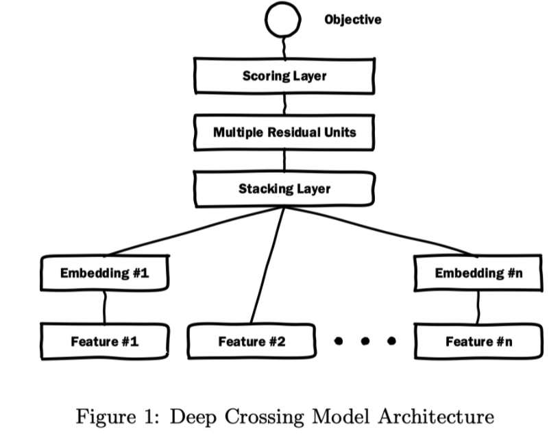

# 1. 背景

​		Deep Crossing模型是微软于2016年在KDD上提出的模型，论文可在[链接]()中下载由于手工设计特征（特征工程）花费巨大精力，因此文章提出了Deep Crossing模型自动联合特征与特征交叉。以现在的角度看待这个模型是非常简单的，也就是Embedding+MLP的结构，但在当时是有非常巨大的影响的。

​		Deep Crossing模型的应用场景是微软的搜索引擎Bing中的搜索广告的推荐场景，即文章提到的Sponsored search（赞助搜索）。当用户在搜索引擎中输入搜索词时，除了返回对应的搜索结果，还会有与搜索词相关的广告。这与之前单纯的电商场景不同，因为有搜索的关键词，那么推送给用户的广告将更为精确。

# 2. 模型结构及原理

​		DeepCrossing是一个端到端的模型，模型结构如下图所示：

<center>        <br>    <div style="color:orange; border-bottom: 1px solid #d9d9d9;    display: inline-block;    color: #999;    padding: 2px;">图1 DeepCrossing模型结构</div> </center>

## 2.1 Embedding层

​		Embedding的主要目的是将高维稀疏特征转化为低维稠密特征。Embedding是NLP里面常用的一种技术，这里的Feature #1表示的类别特征(one-hot编码后的稀疏特征向量）， Feature #2是数值型特征，不用embedding， 直接到了Stacking Layer。 

## 2.2 Stacking层

​		这个层是把不同的Embedding特征和数值型特征拼接在一起，形成新的包含全部特征的特征向量，该层通常也称为连接层。

## 2.3 MLP层

​		该层的主要结构是MLP， 但DeepCrossing采用了残差网络进行的连接。残差单元的网络结构如下：

<center>        <br>    <div style="color:orange; border-bottom: 1px solid #d9d9d9;    display: inline-block;    color: #999;    padding: 2px;">图1 DeepCrossing模型结构</div> </center>

​		有分析说明，残差结构能更敏感的捕获输入输出之间的信息差。

## 2.4 Scoring层

​		Scoring层就是输出层。对于CTR预估模型，往往是一个二分类问题，因此采用逻辑回归来对点击进行预测。

# 3. 模型实现

## 3.1 残差层的实现

```
class Residual_Block(nn.Module):

    def __init__(self, input_size, hidden_size):
        super(Residual_Block, self).__init__()
        self.linear1 = nn.Linear(input_size, hidden_size)
        self.linear2 = nn.Linear(hidden_size, input_size)
        self.relu = nn.ReLU()
    
    def forward(self, x):
        orig_x = x.clone()
        # 这里保留了原来x的信息防止赋值引用带来的值变化
        x = self.linear1(x)
        x = self.linear2(x)
        out = self.relu(x + orig_x)
        return out
```

## 3.2 网络实现

```

class Deep_Crossing(nn.Module):
    
    def __init__(
        self,
        number_of_category_feature,
        number_of_total_feature,
        list_of_nunique_category,
        hidden_size_for_residual_block,
        embedding_size
    ):
        super(Deep_Crossing, self).__init__()
        self.number_of_category_feature = number_of_category_feature
        self.number_of_total_feature = number_of_total_feature
        self.list_of_nunique_category = list_of_nunique_category
        # 统计传入残差层前拼接的维度 (5+10+15+15+20+20*5+10=175)
        total_size_for_single_sample = sum(
            i if i<=embedding_size else embedding_size for i in list_of_nunique_category
        ) + (number_of_total_feature - number_of_category_feature)
        self.hidden_size_for_residual_block = hidden_size_for_residual_block
        self.embedding_size = embedding_size
        
        self.residual_blocks =  nn.ModuleList([
            Residual_Block(total_size_for_single_sample, size) for size in hidden_size_for_residual_block
        ]) # 残差模块
        self.Full_connect_layer_after_residual_block = nn.Linear(total_size_for_single_sample, 1) # 输出前的全连接层
        self.Sigmoid = nn.Sigmoid()
        
    def forward(self, x):
        x_numeric, x_category = x[:, :-self.number_of_category_feature], x[:, -self.number_of_category_feature:]
        one_hot_list = []
        for i in range(x_category.shape[1]):
            embedded_feature = torch.zeros(
                x.shape[0], self.list_of_nunique_category[i]
            ).scatter_(
                1, x_category.T[i].reshape(-1,1).long(), 1) # 转化为one-hot类型的feature
            if embedded_feature.shape[-1]>self.embedding_size: # 对维度大于20的进行嵌入
                embedded_feature = nn.Linear(self.list_of_nunique_category[i], self.embedding_size)(embedded_feature)
            one_hot_list.append(embedded_feature)
        x_category = torch.cat(one_hot_list, -1) # 拼接分类变量
        x = torch.cat([x_numeric, x_category], -1) # 拼接分类变量和数值变量
        for block in self.residual_blocks: # 进入残差层
            x = block(x)
        x = self.Full_connect_layer_after_residual_block(x)
        out = self.Sigmoid(x)
        return out
```


# 4. 总结

​		DeepCrossing的结构比较清晰和简单，没有引入特殊的模型结构，只是常规的Embedding+多层神经网络。但这个网络模型的出现，有革命意义。DeepCrossing模型中没有任何人工特征工程的参与，只需要简单的特征处理，原始特征经Embedding Layer输入神经网络层，自主交叉和学习。

# 参考

https://blog.csdn.net/Blank_spaces/article/details/107625527

https://zhuanlan.zhihu.com/p/357313617

https://zhuanlan.zhihu.com/p/91057914

https://mp.weixin.qq.com/s/RqfUquT0dYZRnQ0oXKc75w

https://github.com/datawhalechina/team-learning-rs/blob/master/DeepRecommendationModel/DeepCrossing.md