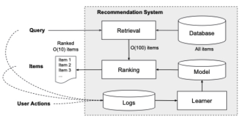
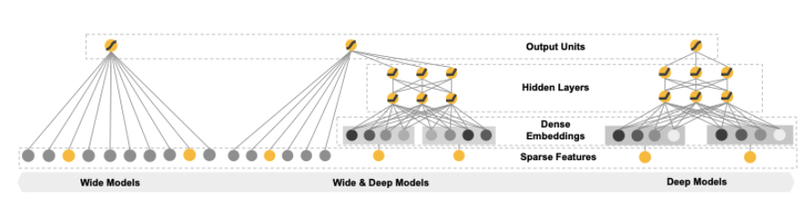
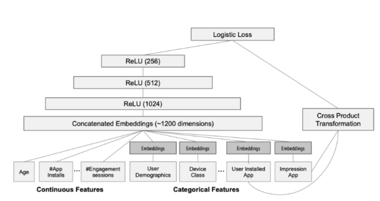

# 1. 论文学习

​		Wide & Deep 是 Google 在2016年发表的论文，论文题目是《Wide & Deep Learning for Recommender Systems》。论文可在[链接](https://arxiv.org/abs/1606.07792)中下载。

​		首先我们需要了解推荐系统。app推荐系统概述如图1所示。当用户访问 app store 时，会生成一个query，其中可能包括许多user和文本特征。推荐系统返回一个 app 列表(也被称为展示（impressions）），用户可以在这些展示的app上执行某些操作，如点击或购买。这些用户行为，连同 queries 和 impressions，都被记录在日志中，作为学习者的训练数据。

             
图1 APP推荐系统概述
 

​		因为数据库中有过百万的apps，所以对于每一个query，我们去对全部的app计算score不合理，在服务延迟要求（通常是O(10)毫秒）内很难完成。**因此，收到一个query之后的第一步是retrieval（检索）。**检索系统返回一个items的短列表，是和query在不同标记（signals）上最匹配的一个app列表，这个列表是通过机器学习和人工定义的大量标记找出来的。**在减少了候选池后，排序系统通过对这些items按score再对其进行排序。**而这个scores通常就是给定的特征 x 下，用户行为标签 y 的概率值 P(y|x)。特征 x 包括一些用户特征（例如：国家，语言，人口统计资料），文本特征（设备，使用时长）和展示特征（app历史统计数据）。在本论文中，我们主要关注的是使用 Wide & Deep 学习框架的排序模型。

​		在这篇文章中，作者**提出了一个 wide and deep 联合学习模型，同时训练 wide linear models 和 deep neural networks，去为推荐系统结合memorization和generalization的好处**。那么什么是 memorization 和 generalization 呢？**Memorization可以被大概定义为学习items或者features的频繁共现，在历史数据中探索可行的相关性。Generalizaion，则是基于相关性的传递，去探索一些在过去没有/很少出现过的特征组合**。基于memorization的推荐相对来说具有局部性，是在哪些用户和items已经有直接相关联的活动上。相较于memorization，generalization尝试去提高推荐items的多元化。

​		这篇文章的主要贡献有：

* 为一般的带有稀疏输入的推荐系统，联合训练使用了embedding的前向神经网络和使用了交叉特征的线性模型。
* Wide & Deep 推荐系统的实现与评估已经在Google Play上投入使用。
* 已经在TensorFlow中开源了实现和一个高级API。

​        Wide & Deep 模型结构如图2所示。图2的左侧就是Wide的部分，其实就是一个线性模型，这一侧的输入特征主要包括原始的特征以及经过非线性变换后的特征。Deep部分是一个前向神经网络，如图2的右侧所示。原始输入是特征字符串，每一个这种稀疏、高维特征被先转换为一个低维稠密的实值向量（通常为一个 embedding 向量）。模型是一个全连接模型，激活函数为ReLU。

             
图2 Wide and Deep 模型结构
 

​		 Wide & Deep 模型是通过联合训练（Joint-training）的方式进行训练。注意，joint training 和 ensemble 是有区别的。联合训练就是将wide部分以及Deep部分的输出层按权重组合起来进行训练。反向传播时，使用FTRL训练Wide部分，使用AdaGrad训练Deep部分。

# 2. 系统实现

​		实验中将W&D模型用在APP推荐系统中，所用的模型结构展示在图3中。训练阶段，输入层吸收训练数据，词汇，生成稀疏和稠密特征。Wide模块包含用户安装的app和展示的app的交叉特征。对于深度模块，我们为每个类别特征学习了32维的emedding特征。并将全部的embedding特征串联起来，获得一个近似1200维的稠密向量。并将该向量传入3层的RELU隐层，最终获得逻辑输出单元。

             
图3 Wide and Deep 模型用于APP推荐系统
 

# 3. 思考题

1. 在你的应用场景中，哪些特征适合放在Wide侧，哪些特征适合放在Deep侧，为什么呢？

   答：从论文原理上看，与标签（结果）直接相关的特征用wide，反之用deep，因为deep端可以探索一些在过去没有/很少出现过的特征组合。高维稀疏类特征和人工手动交叉特征适合在Wide端，因为Wide端侧重记忆，可以记住这些出现过的模式，并且LR模型比深度模型更适合学习高维稀疏特征。

2. 为什么Wide部分要用L1 FTRL训练？

   答：类FTRL等算法学习更新后会将参数变得很稀疏，便于存储，是一种稀疏性很好，精度又不错的随机梯度下降方法。W&D采用L1 FTRL是想让Wide部分变得更加稀疏。

3. 为什么Deep部分不特别考虑稀疏性的问题？

   答：因为过度稀疏的特征不会选择作为Deep部分的输入，其输入一般是稠密低维的Embedding向量。