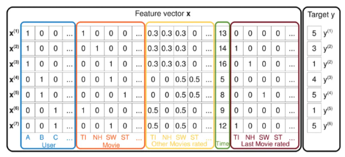
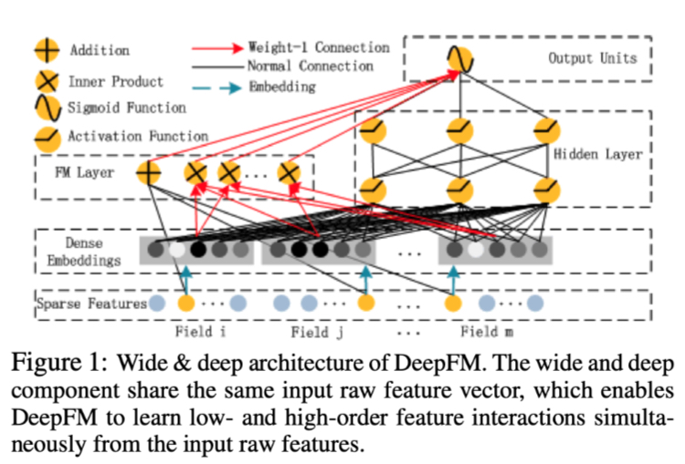
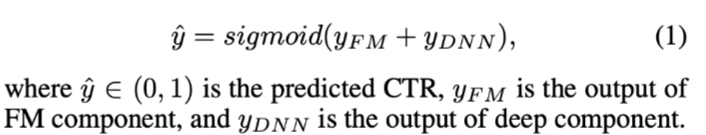
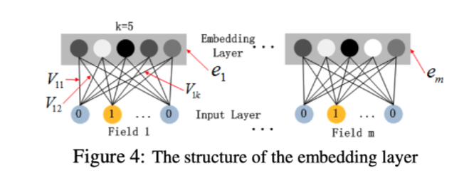
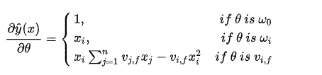

​		DeepFM 是华为和哈工大在2017年发表的论文，论文题目是《DeepFM: A Factorization-Machine based Neural Network for CTR Prediction》。论文可在[链接](https://arxiv.org/pdf/1703.04247.pdf)中下载。

# 1. FM学习

​		在学习DeepFM之前，我们可以先了解一下[FM](https://www.csie.ntu.edu.tw/~b97053/paper/Rendle2010FM.pdf)。FM的全称是**Factorization Machines**，翻译过来就是因式分解机。FM 结合了 SVM 的优点，利用了因式分解模型。FM的优点有：（1）FMs可以在非常稀疏的数据上进行参数估计；（2）FMs的复杂度是线性的，方便优化，不需要依赖支持向量，适用于大型的数据集；（3）FMs是通用的预测模型，可以适用于任意的实值的特征向量。

​		在FM的论文中，举了一个真实的稀疏场景的例子，我们的问题是**预测用户对于一部电影的评分**。图1是样本矩阵。

             
图1 FM-稀疏场景
 

​		图1中左边一大块是特征向量x，右边的Target y表示的预测结果，也就是用户可能对电影做出的评价，评价共有[1, 2, 3, 4, 5]这5种可能，也就是说这是一个多分类的问题。每一行对应的是一个用户。每一色块中都是 one-hot 数组，我们假设用户的数量是U，电影的数量是M，那么最后得到的整个特征的维度数应该是U+3M+1。可想而知，当用户数量上百万之后，这将是一个非常庞大的数字。而**在这么庞大的维度当中只有少数的一些维度是有值的**，其余均为0。那么FM是如何对这样稀疏的特征矩阵起作用的呢？

​		首先，FM 引入了新的矩阵V，矩阵V是一个n x k的二维矩阵。这里的k是我们设置的参数，一般不会很大，比如16、32之类。对于特征每一个维度i，我们都可以找到一个 Vi，它表示一个长度为k的向量。Vi*Vj则可以表示xi和xj特征组合之后的参数。这种**用向量的内积来计算得到了就交叉特征的系数**，**既引入了特征交叉，又解决了复杂度以及模型参数的问题**，将参数的量级为O(n)，n为特征维度。通常我们并不需要设置非常大的K，因为特征矩阵往往非常稀疏，我们可能没有足够多的样本来训练这么大量的参数，并且**限制K也可以一定程度上提升FM模型的泛化能力**。

# 2. DeepFM学习

​		首先我们来看一下DeepFM论文中的模型结构，如图2所示。

             
图2 DeepFM模型结构
 

​		DeepFM包含两部分：DNN（深度神经网络）部分与 FM（因子分解机）部分，分别负责高阶特征的提取和低阶特征的提取。与Wide&Deep模型不同的是，Deep模型的这两部分**共享同样的输入**。DeepFM模型最终的预测结果如图3所示，比较好理解。Deep部分用来训练特征的一维联系，FM模型会计算特征之间的二维交叉的信息，最后二者得到的信息汇总到一起，进入sigmod层，获得最终结果。

             
图3 DeepFM输出
 

​		图1中左侧FM部分是一个因子分解机，暂不详述。图1右侧的深度部分则是一个前馈神经网络。可以看到，在输入DNN之前，所有的输入特征会被转为 embedding 向量，具体实现就是引入一个Embedding layer。

​		嵌入层(embedding layer)的结构如图4所示。当前网络结构有两个特性，1）尽管不同field的输入长度不同，但是embedding之后向量的长度均为K。2)在FM里得到的隐变量Vik现在作为了嵌入层网络的权重。

             
图4 DeepFM 中的 Embedding 层
 

# 思考题

1. 如果对于FM采用随机梯度下降SGD训练模型参数，请写出模型各个参数的梯度和FM参数训练的复杂度

   答：各参数梯度如下图所示：

   

   ​		FM参数训练的复杂度为 O(kn)。

2. 对于下图所示，根据你的理解Sparse Feature中的不同颜色节点分别表示什么意思

​		答：我的理解是，每个Field都是一个one-hot向量，所以蓝色表示one-hot向量中的0，黄色表示one-hot向量中的1。

# 参考

1. [FM模型理解](https://mp.weixin.qq.com/s?__biz=MzUyMTM5OTM2NA==&mid=2247488065&idx=1&sn=a904fd97b7b13e68112228fe57a28b2d&chksm=f9daef6acead667c79ee585b63a2d9cc8bc09198aa35a9b2818d702b7225fb5d4008da8f8ace&scene=21#wechat_redirect)

2. [推荐系统召回四模型之：全能的FM模型](https://zhuanlan.zhihu.com/p/58160982)

3. [分解机(Factorization Machines)推荐算法原理](https://www.cnblogs.com/pinard/p/6370127.html)

4. [推荐系统之《Factorization Machines》论文精读](https://blog.csdn.net/u011984148/article/details/99439475)

5. [推荐系统遇上深度学习(三)--DeepFM模型理论和实践](https://www.jianshu.com/p/6f1c2643d31b)

6. [team-learning-rs](https://github.com/datawhalechina/team-learning-rs)/[DeepRecommendationModel](https://github.com/datawhalechina/team-learning-rs/tree/master/DeepRecommendationModel)

7. [DeepFM代码学习](https://mp.weixin.qq.com/s/QtMXx6gOt-cveMGmOC4uYw)

   

