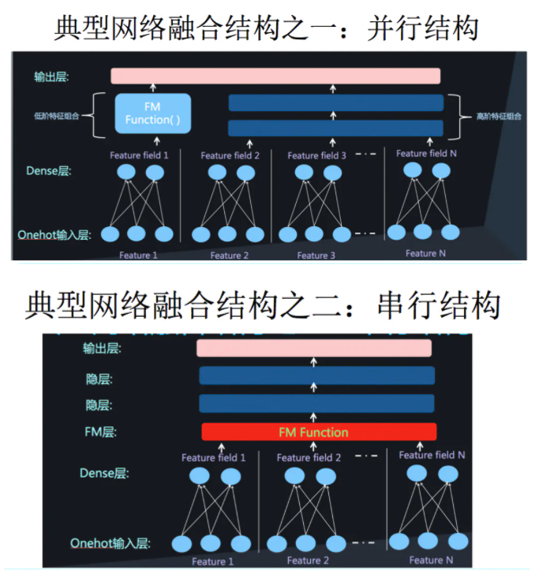
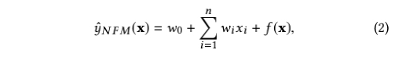
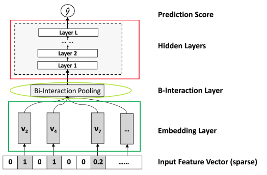

# 1. 理论学习

​		NFM 是发表于SIGIR 2017的论文，论文题目是《Neural Factorization Machines for Sparse Predictive Analytics》。论文可在[链接](https://arxiv.org/abs/1708.05027)中下载。

​		我们之前学到，FM可以充分学习到二阶特征之间的相互作用，但FM仅仅以线性的方式组合了特征，并不能考虑到特征之间的非线性关系。而神经网络很适合学习高阶特征的非线性关系，所以NFM的作者提出了这样一个称为Neural Factorization Machine (NFM)的模型，充分结合了FM提取的二阶线性特征与神经网络提取的高阶非线性特征。

​		看到这我们大概明白了，NFM就是DNN+FM的融合。那么问题来了，同样是DNN+FM，NFM跟我们之前学到的DeepFM有什么区别？可以看下面的图1：

             
图1 DNN与FM的融合方式
 

​		DNN+FM的融合总的来说有两种形式，一是串行结构，二是并行结构，DeepFM是并行结构中的一种典型代表，而NFM则是串行结构。NFM模型的公式如图2所示。其实跟FM的公式很相似, 只是把FM的二阶部分换成了更为复杂的形式。

             
图2 NFM模型公式
 

​		NFM模型结构如图3所示，底层考虑了特征的交叉，然后高层使用的DNN网络。

             
图3 NFM模型结构
 

​		图3中的**Embedding Layer**和之前学习的几个网络是一样的，embedding 得到的vector其实就是我们在FM中要学习的隐变量v。B-interaction层（特征交叉池化层）对应的图2的 f(x)，其实它就是计算FM中的二次项的过程，因此得到的向量维度就是我们的Embedding的维度。这一层的加入使得FM与DNN可以无缝连接，这也是NFM的核心创新。

​		Bi-Interaction层不需要额外的模型学习参数，更重要的是它在一个线性的时间内完成计算，和FM一致的，即时间复杂度为$O\left(k N_{x}\right)$，$N_x$为embedding向量的数量。参考FM，可以将上式转化为：
$$
f_{B I}\left(\mathcal{V}_{x}\right)=\frac{1}{2}\left[\left(\sum_{i=1}^{n} x_{i} \mathbf{v}_{i}\right)^{2}-\sum_{i=1}^{n}\left(x_{i} \mathbf{v}_{i}\right)^{2}\right]
$$

# 2. 思考题

1. NFM中的特征交叉与FM中的特征交叉有何异同，分别从原理和代码实现上进行对比分析

   答：两者主要是隐向量的获得方式不同，一个是通过FM训练得到，一个是通过神经网络训练得到。作者的Bi-interaction层就是为了表示FM中的二阶交互，该层对embedding向量进行低阶的特征交互，提高了神经网络的高阶特征交叉的能力。

# 参考

1. [推荐系统遇上深度学习(七)--NFM模型理论和实践](https://www.jianshu.com/p/4e65723ee632)
2. [NFM 模型 (论文精读)--广告&推荐](https://zhuanlan.zhihu.com/p/42392091)
3. https://zhuanlan.zhihu.com/p/166122223
4. [team-learning-rs](https://github.com/datawhalechina/team-learning-rs)/[DeepRecommendationModel](https://github.com/datawhalechina/team-learning-rs/tree/master/DeepRecommendationModel)