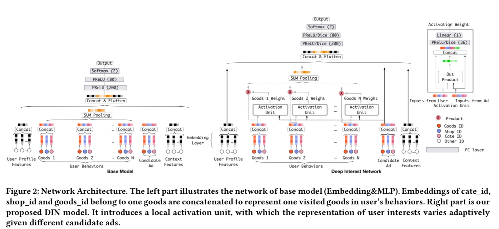

# 1. 理论学习

​		DIN 是阿里妈妈算法团队发表在 KDD 2018 上的论文，论文题目是《Deep Interest Network for Click-Through Rate Prediction》。论文可在[链接](https://arxiv.org/abs/1706.06978)中下载。

​		论文的动机是*从用户有丰富的历史行为中捕捉用户兴趣*，而用户的兴趣有以下两个特点：（1）**多样性（Diversity）**：即用户在线上购物时往往同时表现出多种兴趣；（2）**局部聚焦（Local Activation）**即用户是否会点击推荐给他的某一件商品，往往是基于他之前的部分兴趣，而非所有兴趣。受到NLP里提出的Attention机制启发，Deep Interest Network (DIN) 采用了类似机制实现用户兴趣的Diversity和Local Activation。

​		DIN的模型结构如图1所示。图1左侧是 base 模型，就是Embedding&MLP的形式，自底向上分为三大模块：Embedding layer，Pooling & Concat layer和MLP。图1右侧是对base模型进行之后的DIN 模型。可以看到，相比原来的base model，DIN在生成用户embedding vector的时候加入了一个 Activation Unit层，这一层产生了每个用户行为 ![[公式]](https://www.zhihu.com/equation?tex=V_i) 的权重，详细说就是，**能够根据用户历史行为特征和当前广告的相关性给用户历史行为特征embedding进行加权。**

             
图1 DIN模型结构
 

​		Activation Unit 通过 weight 的多样化实现了更多样化的用户兴趣表示。而 weight 是根据候选广告与历史行为一起决定的，即使用户的历史行为相同，但不同的候选广告与各个行为的weight也是不同的，即用户兴趣表示也是不同的。DIN希望通过 Activation Unit 实现“pay attension”，即赋予和候选广告相关的历史兴趣更高的weight，从而实现Local Activation。A

​		理论方面讨论结束之后，文中提出了两个技巧来辅助工业级深度网络模型的训练，同时也提升了DIN的性能。

- **Adaptive Regularization** / **Mini-batch Aware Regularization** 

- **Data Adaptive Activation Function （Dice）**

  论文的主要工作内容如下：

- 通过对实际业务的观察思考，提出了用户兴趣具有 Diversity 与 Local Activation 两个特点

- 提出 Deep Interest Network，DIN 从用户历史行为中挖掘用户兴趣，针对每个候选广告，使用Activation Unit计算其与用户历史行为商品的相关weight，有效捕捉了用户兴趣的两个特点

- 在模型训练优化上，提出了Dice激活函数与自适应正则，有效提升了模型性能

- 在公开数据集以及Alibaba实际数据集中取得了非常有效的提升

# 参考

https://github.com/datawhalechina/team-learning-rs/blob/master/DeepRecommendationModel/DIN.md

https://zhuanlan.zhihu.com/p/51623339

https://zhuanlan.zhihu.com/p/54085498